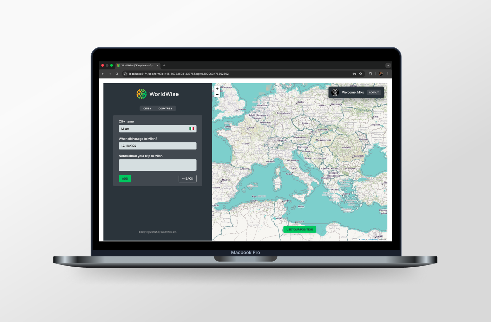

# [World Wise 🌍](https://world-wise-mihailomarkovic.netlify.app/)

## Introduction

WorldWise is a modern travel tracking web application that helps users document and visualize their global adventures. Built with React and leveraging interactive mapping technology, the application allows users to mark cities they've visited on an interactive world map, add personal notes and dates to their travel experiences, and explore their travel history through organized city and country lists. The application integrates React Router for seamless navigation, Context API for state management, and geocoding services for automatic location detection, creating an intuitive and engaging way to track and share travel memories.

## Project Highlights

- Implemented React Router with protected routes and lazy loading for optimized performance and secure navigation.

- Utilized React Context API with useReducer for centralized state management of cities data and authentication.

- Integrated React Leaflet for interactive map visualization with custom markers and click-to-add functionality.

- Created custom React hooks (useGeolocation, useUrlPosition) for reusable location-based features.

- Integrated reverse geocoding API (BigDataCloud) to automatically fetch city and country information from map coordinates.

- Designed a responsive user interface with CSS Modules for component-scoped styling and maintainability.

- Built a JSON Server backend simulation for RESTful API operations (GET, POST, DELETE).

## What I Learned

During this project, I explored several modern React concepts and best practices, including:

- **React Context API** – Managing global application state with Context providers and custom hooks, replacing the need for prop drilling and creating a clean state management solution.

- **useReducer Hook** – Implementing complex state logic with reducers for predictable state updates, especially useful for managing async operations and multiple related state values.

- **Custom Hooks** – Creating reusable hooks (useGeolocation, useUrlPosition) to encapsulate location-based logic and URL parameter handling, promoting code reusability and separation of concerns.

- **React Router v6** – Implementing nested routes, protected routes, URL parameters, and search parameters for comprehensive navigation and data flow.

- **Lazy Loading** – Utilizing React.lazy() and Suspense for code splitting and performance optimization, reducing initial bundle size.

- **Map Integration** – Working with React Leaflet to create interactive maps, handle map events, and synchronize map state with application data.

- **Geolocation & Geocoding APIs** – Integrating browser Geolocation API and external reverse geocoding services to enhance user experience with automatic location detection.

- **Form Management** – Implementing controlled form inputs with React state, date pickers, and form validation for creating and managing travel entries.

## Project Features

- Interactive world map with click-to-add functionality for marking visited cities.

- Automatic city and country detection using reverse geocoding when clicking on the map.

- Add travel entries with city name, visit date, and personal notes.

- View all visited cities in an organized list with country flags and visit dates.

- Browse cities by country with aggregated country statistics.

- Detailed city view with formatted dates, notes, and Wikipedia links.

- Delete cities from your travel history.

- Use browser geolocation to center the map on your current location.

- Protected routes requiring authentication to access the main application.

- Responsive design ensuring a seamless experience on desktop, tablet, and mobile devices.

- Loading states and error handling for all async operations.

- URL-based state management for map positions and form data.

## Technologies Used

- React 18
- React Router DOM v6
- React Leaflet
- Leaflet
- React Context API
- React DatePicker
- Geolocation API
- BigDataCloud Reverse Geocoding API
- JSON Server
- CSS Modules
- JavaScript (ES6+)

## Closing Thoughts

WorldWise was an excellent project for mastering React state management patterns and integrating complex features like interactive maps and geocoding services. It provided hands-on experience with Context API and useReducer for managing application state, React Router's advanced routing features including protected routes and lazy loading, and working with external APIs for location services. This project reinforced the importance of proper state architecture, efficient data fetching strategies, and creating intuitive user interfaces. Working with map integration, custom hooks, and form management gave me valuable insights into building production-ready applications that combine multiple technologies seamlessly. The project demonstrated how React's component-based architecture and hooks system enable building complex, interactive applications while maintaining clean and maintainable code.
